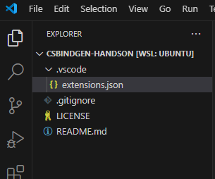

<!-- _header: "" -->
<!-- _paginate: skip -->
<!-- _footer: "" -->
<!-- _class: top -->

# csbindgenで遊んでみよう
あいうえお@阪大OUCC

---
# 自己紹介
- 所属： 大阪大学　コンピュータクラブ
- メインプログラミング言語： C#
  - ufcppさんの.NET Previewを見ていく配信をリアタイするぐらいには好き
- 趣味： ゲーム（最近だと原神）

---
# ごめんなさい
- 本日の勉強会は自分がRust/C/C++初心者のため内容がかなり薄くなってます
- 誤字脱字は大きな目で見てくださるとありがたいです

---
# csbindgenってなに

---
# csbindgenってなに①
- [nunecc](https://github.com/neuecc)さんが開発したライブラリ
  - [UniTask](https://github.com/Cysharp/UniTask)とか[MessagePack for C#](https://github.com/MessagePack-CSharp/MessagePack-CSharp)とか[R3](https://github.com/Cysharp/R3)の作者さん
  - Unityでゲーム開発されてる方は本当にお世話になっている方も多いはず……
- gitbubのリンク
  - https://github.com/Cysharp/csbindgen

---
# csbindgenってなに②
- **C/C++ -> C#, Rust -> C#のFFI補助ツール**
  - 大量のコード（関数）を連携させるのがかなり楽に
    - 今までは全てのC#メソッドに`[DllImport]`属性を手書きしないといけなかった
  - エントリ ポイントの呼び出し規約をRust,csbindgenが良しなにしてくれる
    - linux,windowsで呼び出し規約を切り替えることもあったとかなかったとか……

---
# FFI(Foreign Function Interface)とは
- 簡単にいうと別言語の関数を呼び出す機能
- たいてい既存のライブラリ（特にC/C++）を別言語でも使いたいとかいうのに使われている

---
# csbindgenのここがすごい

---
# csbindgenのここがすごい①
- `[DLLImport]`の自動化
  - 今まではFFIで使用したい関数**すべて**につけないといけなかったのが自動生成
  - 何ならこれが一番すごいまである。このコード×数十とかいう日には苦痛でしかない
```csharp
[DllImport("foge", EntryPoint = "foge_fuga",
 CallingConvention = CallingConvention.Cdecl, ExactSpelling = true)]
internal static extern int fuga(int a);
```

---
# csbindgenのここがすごい②
- オブジェクト指向的にFFI元関数を呼び出せる
  - FFIの都合上関数のみ呼び出せるので`foge.fuga()`ではなく`NativeMethods.fuga(hoge)`のようになってしまう
  - ソースコードジェネレータで`foge.fuga()`用の`fuga()`を自動生成可能

---
# csbindgenのここがすごい③
- RustとCの両方からFFIができる
  - `csbindgen`でRust -> C#のFFIができるようになった。
  - Cのコードは`bindgen`というべつライブラリでC->Rustを実現
    - これを組み合わせてCの処理をRustで整えてC#に渡すといったことが簡単にできる
    - Cのコードベースが膨大でRust/C#に完全には移せないときにはかなり有効

---
# csbindgenのここがすごい④
- コンパイルが簡単
  - C/C++のコンパイルをRustの`cc`/`cmake`クレートを用いることで楽にC/C++/Rust統合ネイティブライブラリを作成できる
    - 簡単なライブラリなら数行でコンパイルとバインディングが完了
  - Rust/C#用のFFIソースコード生成も`cargo`のビルドシステムに乗せることでさらに簡略化

---
# プロジェクトの準備

---
# プロジェクトの準備
- 今回の勉強会用リポジトリを立てたのでそちらからクローンしてきてください
```bash
git clone https://github.com/aiueo-1234/csbindgen-handson.git
# sshがいい人は git clone git@github.com:aiueo-1234/csbindgen-handson.git
```
- クローンしてvscodeで開いたら以下のような感じになっていると思います


---
# プロジェクトの準備　～C#セットアップ～
- ソリューションファイルとFFI用ライブラリ・実行用コンソールアプリを作成する
  - 以下のコマンドをvscodeのターミナルで実行すると作成できる
  - 以降Windows本体で行っている人は適宜`/`（スラッシュ）を`\`(バックスラッシュ)か`¥`に読み替え
```bash
# wsl用
dotnet new sln -n CsbindgenHandsOn
dotnet new classlib -n CsbindgenHandsOn -o src/CsbindgenHandsOn
dotnet new console -n ConsoleApp -o sandbox/ConsoleApp
dotnet sln add src/CsbindgenHandsOn/CsbindgenHandsOn.csproj
dotnet sln add sandbox/ConsoleApp/ConsoleApp.csproj 
```

---
# プロジェクトの準備 ～C#依存関係設定～
- コンソールアプリにFFIライブラリへの参照を追加
  - `ConsoleApp.csproj`を開いて以下の内容を`<PropertyGroup>`と同一階層に追記
```xml
<Project Sdk="Microsoft.NET.Sdk">

　<PropertyGroup>
　  <!-- 省略 -->
　</PropertyGroup>
　　
　<ItemGroup>
　  <ProjectReference Include="..\..\src\CsbindgenHandsOn\CsbindgenHandsOn.csproj" />
　</ItemGroup>

</Project>
```

---
# プロジェクトの準備 ～csbindgenの参照追加～
- コンソールアプリにFFIライブラリへの参照を追加
  - `CsbindgenHandsOn.csproj`を開いて以下の内容を`<PropertyGroup>`と同一階層に追記
```xml
<ItemGroup>
  <PackageReference Include="csbindgen" Version="1.9.3">
    <IncludeAssets>
      runtime; build; native; contentfiles; analyzers; buildtransitive
    </IncludeAssets>
    <PrivateAssets>all</PrivateAssets>
  </PackageReference>
</ItemGroup>
```
---
# プロジェクトの準備 ～C#ビルド設定①～
- unsafeコードを許可するように変更
  - `CsbindgenHandsOn.csproj`を開いて以下のように`<PropertyGroup>`を変更
```xml
<PropertyGroup>
  <TargetFramework>net8.0</TargetFramework>
  <ImplicitUsings>enable</ImplicitUsings>
  <Nullable>enable</Nullable>
  <AllowUnsafeBlocks>true</AllowUnsafeBlocks> <!-- ここ -->
</PropertyGroup>
```

---
# プロジェクトの準備 ～C#ビルド設定②～
- rustライブラリをC#のバイナリ側にコピーする設定を追加
  - `CsbindgenHandsOn.csproj`を開いて以下の内容を`<PropertyGroup>`と同一階層に追記
```xml
<ItemGroup>
  <None Include="runtimes\$(RuntimeIdentifire)\native\csbindgenhandson.dll"
        Condition="$(RuntimeIdentifire.StartsWith(win))">
    <CopyToOutputDirectory>Always</CopyToOutputDirectory>
  </None>
  <None Include="runtimes\$(RuntimeIdentifire)\native\libcsbindgenhandson.so"
        Condition="$(RuntimeIdentifire.StartsWith(linux))">
    <CopyToOutputDirectory>Always</CopyToOutputDirectory>
  </None>
</ItemGroup>
```

---
# プロジェクトの準備 ～C#ビルド設定③～
- rustのコンパイルをしてC#のプロジェクトにコピーする設定を追加
  - `CsbindgenHandsOn.csproj`を開いて以下の内容を`<PropertyGroup>`と同一階層に追記
```xml
<Target Name="PreBuild" BeforeTargets="PreBuildEvent" Condition="'$(Configuration)'=='Debug'">
  <Exec Command="cargo build"
        WorkingDirectory="$([System.IO.Path]::Combine($(ProjectDir),../libcsbindgenhandson))" />
  <Copy Condition="$(RuntimeIdentifire.StartsWith(win))" 
        SourceFiles="$([System.IO.Path]::Combine($(ProjectDir),../libcsbindgenhandson/target/debug/csbindgenhandson.dll))" 
        DestinationFolder="$([System.IO.Path]::Combine($(ProjectDir),../CsbindgenHandsOn,runtimes\$(RuntimeIdentifire)\native))" />
  <Copy Condition="$(RuntimeIdentifire.StartsWith(linux))"
        SourceFiles="$([System.IO.Path]::Combine($(ProjectDir),../libcsbindgenhandson/target/debug/libcsbindgenhandson.so))" 
        DestinationFolder="$([System.IO.Path]::Combine($(ProjectDir),../CsbindgenHandsOn,runtimes\$(RuntimeIdentifire)\native))" />
</Target>
```

---
# プロジェクトの準備 ～C#ビルド設定④～
- RIDを決めるため、`Directory.Build.props`を`sln`ファイルと同階層に作成

WSLの人
```xml
<Project>
  <PropertyGroup>
    <RuntimeIdentifire>linux-x64</RuntimeIdentifire>
  </PropertyGroup>
</Project>
```
Windowsの人
```xml
<Project>
  <PropertyGroup>
    <RuntimeIdentifire>win-x64</RuntimeIdentifire>
  </PropertyGroup>
</Project>
```
  
---
# プロジェクトの準備　～Rustセットアップ～
- FFI用のRustライブラリを作成します
  - vscodeで新しいターミナルを開いて以下のコマンドを実行してください
```bash
cd ./src
cargo new --lib ./libcsbindgenhandson
```

---
# プロジェクトの準備　～Rustパッケージ設定～
- `Cargo.toml`に以下の内容を追記してください
```toml
[lib]
crate-type = ["cdylib"]
name = "csbindgenhandson"

[build-dependencies]
csbindgen = "1.9.3"
cc = "1.1"
bindgen = "0.70"
```

---
# プロジェクトの準備　～rust-analyzer設定～
- `.vscode/settings.json`を作成し以下の内容を追記してください
  - ここまで出来たらvscodeをリロードしましょう
```json
{
    "rust-analyzer.linkedProjects": [
        "src/libcsbindgenhandson/Cargo.toml"
    ],
}
```

---
# 確認　～ファイル構造～
- こんな感じになっていればOk
<div style="margin-left: 60px">
<image src="./image-1.png"/>
<image src="./image-2.png"/>
</div>

---
# 確認　～CsbindgenHandsOn.csproj～
```xml
<Project Sdk="Microsoft.NET.Sdk">
  <PropertyGroup>
    <TargetFramework>net8.0</TargetFramework>
    <ImplicitUsings>enable</ImplicitUsings>
    <Nullable>enable</Nullable>
    <AllowUnsafeBlocks>true</AllowUnsafeBlocks>
  </PropertyGroup>
  <ItemGroup>
    <None 
      Include="runtimes\$(RuntimeIdentifire)\native\csbindgenhandson.dll"
      Condition="$(RuntimeIdentifire.StartsWith(win))">
      <CopyToOutputDirectory>Always</CopyToOutputDirectory>
    </None>
    <None 
      Include="runtimes\$(RuntimeIdentifire)\native\libcsbindgenhandson.so"
      Condition="$(RuntimeIdentifire.StartsWith(linux))">
      <CopyToOutputDirectory>Always</CopyToOutputDirectory>
    </None>
  </ItemGroup>
```

---
# 確認　～CsbindgenHandsOn.csproj～
```xml
  <ItemGroup>
    <PackageReference Include="csbindgen" Version="1.9.3">
      <IncludeAssets>runtime; build; native; contentfiles; analyzers; buildtransitive</IncludeAssets>
      <PrivateAssets>all</PrivateAssets>
    </PackageReference>
  </ItemGroup>
  <Target Name="PreBuild" BeforeTargets="PreBuildEvent" Condition="'$(Configuration)'=='Debug'">
    <Exec Command="cargo build"
          WorkingDirectory="$([System.IO.Path]::Combine($(ProjectDir),../libcsbindgenhandson))" />
    <Copy Condition="$(RuntimeIdentifire.StartsWith(win))" 
          SourceFiles="$([System.IO.Path]::Combine($(ProjectDir),../libcsbindgenhandson/target/debug/csbindgenhandson.dll))" 
          DestinationFolder="$([System.IO.Path]::Combine($(ProjectDir),../CsbindgenHandsOn,runtimes\$(RuntimeIdentifire)\native))" />
    <Copy Condition="$(RuntimeIdentifire.StartsWith(linux))"
          SourceFiles="$([System.IO.Path]::Combine($(ProjectDir),../libcsbindgenhandson/target/debug/libcsbindgenhandson.so))" 
          DestinationFolder="$([System.IO.Path]::Combine($(ProjectDir),../CsbindgenHandsOn,runtimes\$(RuntimeIdentifire)\native))" />
  </Target>
</Project>
```

---
# Rustの関数を呼び出してみよう

---
# Rustの関数を呼び出してみよう①
- 実際にRustの関数を呼び出してみましょう
- まず以下のように`lib.rs`を書き換えます
```rust
#[no_mangle]
pub extern "C" fn rust_add(x: i32, y: i32) -> i32 {
    x + y
}
```

---
# Rustの関数を呼び出してみよう②
- `Cargo.toml`と同じ階層に`build.rs`を作成して以下のコードを書き込みましょう
  - しばらくすると`CsbindgenHandsOn/Native/NativeMethods.g.cs`ができます
```rust
fn main(){
    csbindgen::Builder::default()
        .input_extern_file("src/lib.rs")
        .csharp_dll_name("csbindgenhandson")
        .csharp_namespace("CsbindgenHandsOn.Native")
        .generate_csharp_file("../CsbindgenHandsOn/Native/NativeMethods.g.cs")
        .unwrap();
}
```

---
# Rustの関数を呼び出してみよう③-1
- `CsbindgenHandsOn`に`NativeMethods.DllImportResolver.cs`を作成して以下のコードをかきこみます
  - あと2ページ程続くので注意してください
```cs
using System.Reflection;
using System.Runtime.InteropServices;

namespace CsbindgenHandsOn.Native
{
    internal static unsafe partial class NativeMethods
    {
        static NativeMethods()
        {
            NativeLibrary.SetDllImportResolver(typeof(NativeMethods).Assembly, DllImportResolver);
        }

        static IntPtr DllImportResolver(string libraryName, Assembly assembly, DllImportSearchPath? searchPath)
        {
            if (libraryName == __DllName)
            {
```

---
# Rustの関数を呼び出してみよう③-2
```cs
                var path = "runtimes/";
                var extension = "";
                if (RuntimeInformation.IsOSPlatform(OSPlatform.Windows))
                {
                    path += "win-";
                    extension = ".dll";
                }
                else
                {
                    path += "linux-";
                    extension = ".so";
                }
                
                if (RuntimeInformation.OSArchitecture == Architecture.X64)
                {
                    path += "x64";
                }
```

---
# Rustの関数を呼び出してみよう③-3
```cs
                else if (RuntimeInformation.OSArchitecture == Architecture.Arm64)
                {
                    path += "arm64";
                }
                path += $"/native/{(!RuntimeInformation.IsOSPlatform(OSPlatform.Windows)?"lib":"")}{__DllName}{extension}";

                return NativeLibrary.Load(Path.Combine(AppContext.BaseDirectory, path), assembly, searchPath);
            }

            return IntPtr.Zero;
        }
    }
}
```

---
# Rustの関数を呼び出してみよう④
- `CsbindgenHandsOn/Class1.cs`のコードをを以下のコードに書き換えて、ファイルを`BasicFunctionCall.cs`に書き換えます
```cs
namespace CsbindgenHandsOn;

public class BasicFunctionCall
{
    public void CallRustAdd(int a, int b){
        Console.WriteLine($"rust_add({a}, {b}): {Native.NativeMethods.rust_add(a,b)}");
    }
}
```

---
# Rustの関数を呼び出してみよう⑤
- `ConsoleApp/Program.cs`のコードを以下のコードに書き換えて実行してみましょう！
  - 実行したら`rust_add(1, 1): 2`と表示されるはずです
```cs
using CsbindgenHandsOn;

var c = new BasicFunctionCall();
c.CallRustAdd(1,1);
```

---
# Rust -> C#時のcsbindgenの使い方
`build.rs`で`csbindgen::Builder::default()`に対して以下の関数をチェーンする
- input_extern_file("rust_file_path")
  - FFI元の関数が書かれたファイルのパスを入れる
- csharp_dll_name("dll_name")
  - `[DllImport]`の`dllName`。つまりRustのライブラリ名
    - 今回は`Cargp.toml`の`[lib]`の`name`を設定したのでそれと同じにする
- csharp_namespace("csharp_namespace")
  - 生成したFFI用C#クラスの名前空間を設定する
- generate_csharp_file("csharp_file_path")
  - 生成したFFI用C#クラスの出力先を指定する
  - これを一番最後に呼ぶ

---
# Rust側のコード解説
- #[no_mangle]
  - Rustコンパイラは、シンボル名をネイティブコードリンカが期待するものとは異なるものにマングル（難読化）するのでそれを防ぐ
- pub extern "C"
  - ABI(Application Binary Interface)をCコンパイラがサポートするものにする
  - C#のFFIもこの形式をサポートしているのでこれにする

---
# C#側のコード解説
- DllImportResolver
  - 結びつけるネイティブライブラリを指定するために用いる
  - windowsとlinux,WSLではライブラリの拡張子やプレフィックスの有無などの違いがあるので調整しないといけない
    - Windows
      - 拡張子：.dll
      - プレフィックス：なし
    - linux, WSL
      - 拡張子：.so
      - プレフィックス：lib

---
# Cの関数を呼び出してみよう

---
# Cの関数を呼び出してみよう①
- `libcsbindgenhandson/src`に`c`ディレクトリを作り、`myMath.h`を作成し以下のコードを書き込む
```c
#ifndef MYMATH_H_
#define MYMATH_H_

int myMath_mul(int a, int b);
int myMath_add(int a, int b);

#endif
```

---
# Cの関数を呼び出してみよう②
- `libcsbindgenhandson/src/c`ディレクトリで、`myMath.c`を作成し以下のコードを書き込む
```c
#include "myMath.h"

int myMath_mul(int a, int b){
    return a * b;
}

int myMath_add(int a, int b){
    return a + b;
}
```

---
# Cの関数を呼び出してみよう③-1
- 以下のコードを`build.rs`の`main`関数に書き込む
  - 次ページにもコードがあるので注意
  - C -> RustのFFIコード生成(`bindgen`)とCのコンパイル(`cc`)をしてくれる
```rust
bindgen::Builder::default()
       .header("src/c/myMath.h").generate().unwrap()
       .write_to_file("src/myMath.rs").unwrap();
cc::Build::new()
    .file("src/c/myMath.c")
    .try_compile("myMath").unwrap();
```

---
# Cの関数を呼び出してみよう③-2
```rust
csbindgen::Builder::default()
    .input_bindgen_file("src/myMath.rs")
    .rust_method_prefix("cffi_")
    .rust_file_header("use super::myMath::*;")
    .csharp_entry_point_prefix("cffi_")
    .csharp_dll_name("csbindgenhandson")
    .csharp_namespace("CsbindgenHandsOn.Native")
    .csharp_class_name("CNativeMethodsMyMath")
    .generate_to_file(
        "src/myMath_ffi.rs",
        "../CsbindgenHandsOn/Native/CNativeMethodsMyMath.g.cs",
    )
    .unwrap();
```

---
# Cの関数を呼び出してみよう④
- `lib.rs`の先頭に下記コードを追記する
  - 生成された`myMath`と`myMath_ffi`をrustコンパイラが認識できるようにする
```rust
#[allow(non_snake_case)]
mod myMath;

#[allow(non_snake_case)]
mod myMath_ffi;
```

---
# Cの関数を呼び出してみよう⑤
- `CsbindgenHandsOn/BasicFunctionCall.cs`のクラスに以下の関数を足します
```cs
public void CallMyMathAdd(int a, int b){
    Console.WriteLine($"myMath_add({a}, {b}): {Native.CNativeMethodsMyMath.myMath_add(a,b)}");
}
```
- 次に`ConsoleApp/Program.cs`のコードに以下のコードを追加して実行しましょう！
  - 実行したら追加で`myMath_add(2, 2): 4`と表示されるはずです
```cs
c.CallMyMathAdd(2,2);
```

---
# C -> C#時のcsbindgenの使い方①
- 使いたいCファイルのヘッダファイルを`bindgen`に読み込ませてC->RustのFFIコードを生成する
- 使いたいCファイルを`cc`を用いてコンパイルする。この時`cc`がRustライブラリにリンクしてくれる
  - `bindgen`, `cc`の詳しい使い方は本題ではないので省きますが、複雑なプログラムであればこれらのクレートを駆使することになります

---
# C -> C#時のcsbindgenの使い方②-1
`build.rs`で`csbindgen::Builder::default()`に対して以下の関数をチェーンする
- input_bindgen_file("bindgen_file_path")
  - `bindgen`が生成したファイルへのパス
- rust_file_header("use super::myMath::*;")
  - `bindgen`が生成したファイルを、`csbindgen`によって生成されたコードが読み込むための`use`を書く
- rust_method_prefix("prefix_")
- csharp_entry_point_prefix("prefix_")
  - RustとC#でのFFI関数をリンクする際にCの関数と被らないようにするためのもの。
  - `rust_method_prefix`と`csharp_entry_point_prefix`は必ずそろえる

---
# C -> C#時のcsbindgenの使い方②-2
- csharp_dll_name("csbindgenhandson")
- csharp_namespace("CsbindgenHandsOn.Native")
- csharp_class_name("CNativeMethodsMyMath")
  - 上三つはRust -> C#のときと同じ
- generate_to_file("rust_ffi_path", "csharp_ffi_path")
  - Rust, C#のFFIコードの出力先をしていする

---
# C -> Rust -> C#で連携してみる

---
# C -> Rust -> C#で連携してみる
- これまでの知識をもちいて、Cの処理をRustで包んでC#に渡してみましょう
  - 具体的にはmyMath_mulをもちいてRustでpow関数を実装し、それをC#から呼べるようにしてみます。

---
# C -> Rust -> C#で連携してみる①
- `lib.rs`に以下のコードを追記します
```rust
use ::std::os::raw::c_int;

#[no_mangle]
pub unsafe extern "C" fn rust_pow(x: c_int, y: c_int) -> c_int {
    let mut ret: c_int = 1;
    for _ in 1..=y {
        ret = myMath::myMath_mul(ret, x);
    }
    ret
}
```

---
# C -> Rust -> C#で連携してみる②
- `CsbindgenHandsOn/BasicFunctionCall.cs`のクラスに以下の関数を足します
```cs
public void CallRustPow(int a, int b){
    Console.WriteLine($"rust_pow({a}, {b}): {Native.NativeMethods.rust_pow(a,b)}");
}
```

---
# C -> Rust -> C#で連携してみる③
- 次に`ConsoleApp/Program.cs`のコードに以下のコードを追加して実行しましょう！
```cs
c.CallRustPow(2,3);
```
- 最終的な出力結果が以下のようになっているはずです。
```
rust_add(1, 1): 2
myMath_add(2, 2): 4
rust_pow(2, 3): 8
```

---
# GroupedNativeMethodsを使ってみよう

---
# GroupedNativeMethodsを使ってみよう
- オブジェクト指向的にFFI元関数を呼び出せるようにする機能
  - FFIの都合上関数のみ呼び出せるので`foge.fuga()`ではなく`NativeMethods.fuga(hoge)`のようになってしまう
  - ソースコードジェネレータで`foge.fuga()`用の`fuga()`を自動生成可能
- 今回はC言語でかなり簡素化したスタックを扱って試してみる

---
# GroupedNativeMethodsを使ってみよう①
- `libcsbindgenhandson/src/c`ディレクトリで、`myStack.h`を作成し以下のコードを書き込む
```c
#ifndef MYSTACK_H_
#define MYSTACK_H_

typedef struct MyStack
{
    int index;
    int *data;
} MyStack;

MyStack *myStack_create(int maxLength);
int myStack_pop(MyStack *myStack);
void myStack_push(MyStack *myStack, int val);
void myStack_delete(MyStack *myStack);

#endif
```

---
# GroupedNativeMethodsを使ってみよう②-1
- `libcsbindgenhandson/src/c`ディレクトリで、`myStack.c`を作成し以下のコードを書き込む
```c
#include "myStack.h"
#include <stdlib.h>

MyStack *myStack_create(int maxLength)
{
    MyStack *ret = malloc(sizeof(MyStack));
    if (ret == NULL)
    {
        return NULL;
    }
    int *data = malloc(sizeof(int) * maxLength);
    if (data == NULL)
    {
        free(ret);
        return NULL;
    }
```

---
# GroupedNativeMethodsを使ってみよう②-2
```c
    ret->index = -1;
    ret->data = data;
    return ret;
}

int myStack_pop(MyStack *myStack){
    return myStack->data[myStack->index--];
}

void myStack_push(MyStack *myStack, int val){
    myStack->data[++myStack->index]=val;
}

void myStack_delete(MyStack *myStack){
    free(myStack->data);
    free(myStack);
}
```

---
# GroupedNativeMethodsを使ってみよう③
- `build.rs`の`main`関数に下記コードを追記する
```rust
bindgen::Builder::default()
    .header("src/c/myStack.h").generate().unwrap()
    .write_to_file("src/myStack.rs").unwrap();
cc::Build::new()
    .file("src/c/myStack.c").try_compile("myStack").unwrap();
csbindgen::Builder::default()
    .input_bindgen_file("src/myStack.rs")
    .rust_method_prefix("cffi_")
    .rust_file_header("use super::myStack::*;")
    .csharp_entry_point_prefix("cffi_")
    .csharp_dll_name("csbindgenhandson")
    .csharp_namespace("CsbindgenHandsOn.Native")
    .csharp_class_name("CNativeMethodsMyStack")
    .generate_to_file(
        "src/myStack_ffi.rs",
        "../CsbindgenHandsOn/Native/CNativeMethodsMyStack.g.cs",
    ).unwrap();
```

---
# GroupedNativeMethodsを使ってみよう④
- `lib.rs`に下のコードを追記して、Rustコンパイラに生成したコードを認識させる
```rust
#[allow(non_snake_case)]
mod myStack;

#[allow(non_snake_case)]
mod myStack_ffi;
```

---
# GroupedNativeMethodsを使ってみよう⑤
- `CsbindgenHandsOn/Native`ディレクトリに`CNativeMethodsMyStack.cs`ファイルを作成し下記コードを書き込む
```cs
using GroupedNativeMethodsGenerator;

namespace CsbindgenHandsOn.Native
{
    [GroupedNativeMethods(removePrefix: "myStack")]
    internal static unsafe partial class CNativeMethodsMyStack { }
}
```

---
# GroupedNativeMethodsを使ってみよう⑥-1
- `CsbindgenHandsOn`ディレクトリに`TestGroupedNativeMethods.cs`ファイルを作成し下記コードを書き込む
```cs
using CsbindgenHandsOn.Native;

namespace CsbindgenHandsOn
{
    public sealed unsafe class TestGroupedNativeMethods 
                               : IDisposable
    {
        private bool _disposed;
        private readonly MyStack* _stack;
        public TestGroupedNativeMethods()
        {
            _stack = CNativeMethodsMyStack.myStack_create(5);
        }
```

---
# GroupedNativeMethodsを使ってみよう⑥-2
```cs
        public void PushAndPop(ReadOnlySpan<int> numbers)
        {
            for (int i = 0; i < numbers.Length && i < 5; i++)
            {
                _stack->Push(numbers[i]);
                Console.WriteLine($"pushed {numbers[i]}");
            }
            for (int i = 0;i < numbers.Length && i != 5; i++)
            {
                Console.WriteLine($"popped {_stack->Pop()}");
            }
        }
```

---
# GroupedNativeMethodsを使ってみよう⑥-3
```cs
        public void Dispose()
        {
            if (_disposed) return;
            _stack->Delete();
            _disposed = true;
        }
    }
}
```

---
# GroupedNativeMethodsを使ってみよう⑦-1
- 次に`ConsoleApp/Program.cs`のコードに以下のコードを追加して実行しましょう！
```cs
using var t = new TestGroupedNativeMethods();
t.PushAndPop([1,2,3,4,5]);
```
- このコードの出力結果が以下のようになっているはずです。
```
pushed 1
pushed 2
pushed 3
pushed 4
pushed 5
```

---
# GroupedNativeMethodsを使ってみよう⑦-2
```
popped 5
popped 4
popped 3
popped 2
popped 1
```

---
# GroupedNativeMethods
- `[GroupedNativeMethods]`をつけたクラスに対してソースコードソースコードを生成する
  - `bindgen`側でこの機能を使用したいメソッドをまとめてRust用コードを生成するとよい
    - もちろんヘッダファイルで分けてもよい
- `[GroupedNativeMethods]`属性を`csbindgen`で生成されたC#FFI用クラスに付ける
  - 生成されたコードに対して属性をつけるのではなく、上書きされないように、`partial`クラスで別ファイルにしてつける

---
# お疲れさまでした！！
